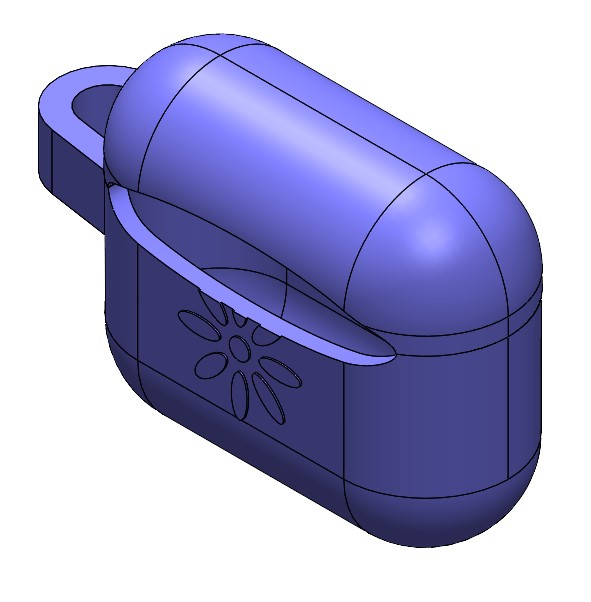

<nav class="navbar">
  

    <a href="https://amgeorge22.github.io/personal-portfolio/home">Home</a>
    <a href="#">Mechanical Projects</a>
    

      <a href="https://amgeorge22.github.io/personal-portfolio/injection-molded-keychain">Injection Molded Keychain</a>
      <a href="#">Urethane Casting Airpods Case</a>
      <a href="#mechanical3">DFM Treasure Box</a>
      <a href="#mechanical4">FSAE Motor Mounting</a>
      <a href="#mechanical5">Tilt-In-Space Wheelchair</a>
      <a href="#mechanical6">Beam Deflection Calculator</a>
      <a href="#mechanical7">3D Printing Variability Study</a>
    

  

  

    <a href="#">Robotics/Mechatronics Projects</a>
    

      <a href="#robotics1">Autonomous Robot Mapping & Navigation</a>
      <a href="#robotics2">Apple Orchard Leaf Blower</a>
      <a href="#robotics3">Corn Stalk Nitrogen Sensing Attachment</a>
      <a href="#robotics4">Automated Poker Dealer</a>
      <a href="#robotics5">Inverted Pendulum Controller</a>
    

  

  

    <a href="#">Software Projects</a>
    

      <a href="#software1">Sudoku Solving with Graph Coloring</a>
      <a href="#software2">Machine Learning Spot-It! Model</a>
      <a href="#software3">SoftDew Valley - Stardew Valley Clone</a>
      <a href="#software4">Poi Style Classifier</a>
    

  

  

    <a href="#">Research Papers</a>
    

      <a href="#research1">When Is It Relevant?</a>
      <a href="#research2">Student Voice in Collaborative AutoEthnography</a>
    

  

</nav>

As part of my Design for Manufacturing course, I designed and fabricated a case to fit around the 3rd generation AirPods charging case.

The goal of this project was to design an AirPods case that could be made out of silicone via urethane casting. The case would be able to fit into a piece of vacuum-formed packaging that a partner created. The case itself needed to be able to fit the AirPods charging case, which has a height of 1.83 inches, a width of 2.14 inches, and a depth of 0.84 inch [1](https://support.apple.com/en-us/111863). The case also needed to have a loop that a carabiner could fit into, a hole for the charging port, and a gap in the back to allow the case to open and close smoothly. One of our design goals was to also have a fun, aesthetic design on the case, which is the flower that you can see below.

The first step to creating this case was designing the case in SOLIDWORKS. The gap mentioned above is visible in the back of the case. The bottom half of the case includes the loop for the carabiner, the hole for the charging port, and the flower design.

In order to create this case, I designed two different molds, one for the top half of the case and one for the bottom half of the case, using SOLIDWORKS Mold Tools. The molds feature a pour spout, which has a chamfer that allows silicone to flow into the mold, and two relief holes on the opposite side that allows excess silicone to flow out of the mold. The features for the AirPods case have a small draft angle to make it easier to remove the final case from the molds. Both molds also have pegs and slots that acts as mating features to align the two halves of the molds.

Both molds were 3D printed. Once the molds were sprayed with mold release, I filled the molds with Smooth On's Dragon Skin silicone [2](https://www.smooth-on.com/products/dragon-skin-20-nv/). I chose to make the case out of silicone because it would be easy to fit the AirPods in the case and pull the case off the AirPods as needed. After allowing the silicone to cure for twenty minutes, a small amount of post-processing had to be done (removing excess silicone from the pour spout and relief holes) Then, the case was ready to put on the AirPods!

Overall, this project was a success, although there is room for improvement. The case feels a little loose, even though it is made to the exact specifications of the AirPods charging case. The top half feels especially loose, likely because it has a smaller surface area. If I were to redo the design, I would slightly shrink the case. I would also make sure to more evenly apply the silicone to the edges of the mold before completely filling it - an air bubble is visible towards the bottom right of the case.

This project marked my first time working with casting and molds. I learned how to identify where to put a parting line (where the two halves of the mold meet) and how to avoid overhangs that would make it difficult to pull the molds apart. I also learned about urethane casting as an option for medium-scale manufacturing, which is a very viable option when outputting hundreds of the same part.

As this was my first foray into urethane casting, I encountered several challenges. The first time I attempted to fill the mold, the silicone did not fill every feature, resulting in a bottom case that looked like this: 

I realized there were two major factors making it difficult to fill the mold - the pour spout being too small and the walls of the case being too thin. The initial diameter of the pour spout was too small, making it difficult to fill the mold before the pot life of the silicone (the amount of time I could work with the silicone before it started curing) ran out. The walls being too thin made it difficult for the silicone to flow through the mold. Making these changes to the mold led to the much more successful AirPods case.

Another challenge I ran into was attempting to remove the layer lines from my 3D printed molds. Silicone can fill every nook and cranny of a mold, including the layer lines that are a byproduct of 3D printing. In my initial mold, I used Smooth-On XTC [3](https://www.smooth-on.com/product-line/xtc-3d/), a coating the fills in the gaps between layer lines. However, likely because I applied too much and because the walls of the AirPods case were very thin, the coating blocked parts of the mold that should be filled with silicone. For the second mold, I elected not to work on with Smooth-On XTC, and while the layer lines are visible on the final product, I am not displeased with the results.

### Cost Analysis
A gallon of Smooth-On's Dragon Skin is $230. Approximately 214 AirPods cases can be made with this volume of silicone, which makes the cost of each case $1.07. The molds use about 160g of PLA filament, which would cost $4.82. For 100 cases, the total cost of materials per case would be $1.12. This does not factor in labor costs, the costs of facilities (gloves for handling silicone, 3D printers, etc.), or packaging and shipping to customers.

### Links
1. https://support.apple.com/en-us/111863
2. https://www.smooth-on.com/products/dragon-skin-20-nv/
3. https://www.smooth-on.com/product-line/xtc-3d/

